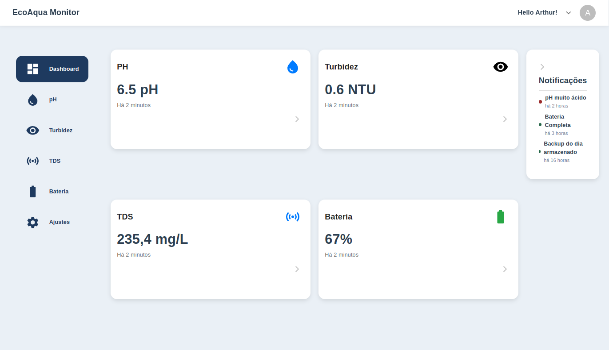

# AQUALERT 🌊🦟

**Sistema de Monitoramento em Tempo Real da Qualidade da Água e Prevenção de Mosquitos**

---

## 🚀 Visão Geral

O AQUALERT é uma solução embarcada e autônoma de baixo custo que realiza o monitoramento em tempo real da qualidade da água em reservatórios. Com sensores de pH, turbidez e TDS, o sistema identifica condições favoráveis à proliferação do mosquito *Aedes aegypti* e aciona automaticamente aeradores, prevenindo a estagnação da água e contribuindo para o combate a doenças como dengue, Zika e chikungunya.

---

## 🎯 Objetivos do Projeto

- Monitorar continuamente a qualidade da água em cisternas e reservatórios.
- Prevenir a proliferação de mosquitos vetores de arboviroses.
- Oferecer uma solução de baixo custo, com energia solar e comunicação LoRa.
- Permitir visualização remota dos dados em um dashboard intuitivo.
- Fortalecer políticas públicas de saúde e sustentabilidade.

---

## 🛠️ Tecnologias Utilizadas

- **Microcontrolador:** ESP32
- **Sensores:** pH, Turbidez, TDS
- **Comunicação:** LoRa (externo ↔ interno), Wi-Fi (dados → web)
- **Energia:** Painel solar + bateria recarregável
- **Dashboard:** Web app hospedado na [Vercel](link)
- **Firmware:** C/C++
- **Web stack:** 

---

## 📊 Funcionalidades

- 🔍 Leitura em tempo real dos parâmetros da água
- 🌬️ Acionamento automático de aerador
- 🌐 Envio remoto de dados para servidor web
- 📈 Visualização gráfica de dados e alertas de anomalias
- 🔋 Operação autossuficiente em energia

---

## 📸 Imagens e Vídeos

> **📷 Dashboard em tempo real:**
> 

> **🎥 Demonstração do sistema em campo (YouTube ou Google Drive):**
> [Ver vídeo ➜](https://link)

---

## 📍 Resultados Alcançados

- 🥇 Vencedor da competição ESC na SBESC 2024
- 📚 Artigo aprovado no SEMISH (CSBC 2025)
- 🏛️ Apresentado na Feira do Conhecimento (Governo do Ceará)
- 🔧 Validação técnica e calibração de sensores em laboratório

---

## 👥 Público-Alvo

- Comunidades rurais
- Secretarias de saúde e meio ambiente
- ONGs e projetos sociais
- Agricultores e usuários de cisternas
- Instituições de pesquisa e ensino técnico

